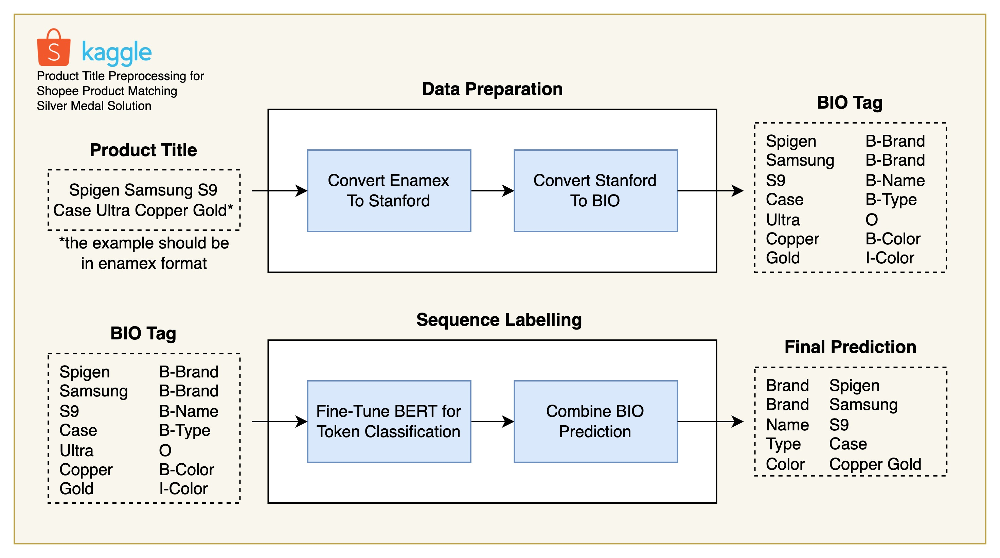
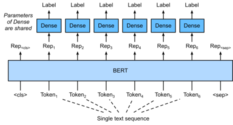

# Product Attribute Extraction

In the e-commerce world, extracting product attributes is important. The extraction of attribute labels and values from free-text product descriptions can be useful for many tasks, such as product matching, product categorization, faceted product search, and product recommendation. 

I use the BERT for token classification model to extract multi-attributes from the product offers in Indonesian e-commerce platform. The dataset is obtained from [this previous work](http://www.scielo.org.mx/scielo.php?script=sci_arttext&pid=S1405-55462018000401367#fn3). There are 16 kinds of attributes in their annotation scheme. Please check the paper directly to get more information about the dataset. 

## Prepare a Docker environment for the experiment
```
docker run --rm -it --name=attribute-extraction --gpus '"device=0"' --shm-size 32G -it --mount type=bind,src=<absolute path to product-attribute-extraction folder>,dst=/workspace/   pytorch/pytorch:1.5.1-cuda10.1-cudnn7-devel

pip install -r requirements.txt
```
Alternatively, you can also use virtual environment.

## Pipeline



### Data Preparation

The dataset is annotated using Enamex format. The preparation contains several steps, i.e. convert enamex to stanford and convert stanford to bio format. After performing a manual inspection on the dataset, I found that there some incorrect labellings from the raw data that cause a failure when converting the enamex into stanford format. To handle this, I manually fix the wrong enamex format from the original file.

```
python preprocess.py
```

### Sequence Labelling

Sequence labeling is a typical NLP task that assigns a specific label or class to each token within a sequence. In this context, a single word is a 'token'. These tags can be used in further downstream models as features of the token, or to enhance the model. Fine-tuning BERT for text tagging applications is illustrated in the figure below.



To fine tune the model, please run this script
```
python fine_tune.py
```


